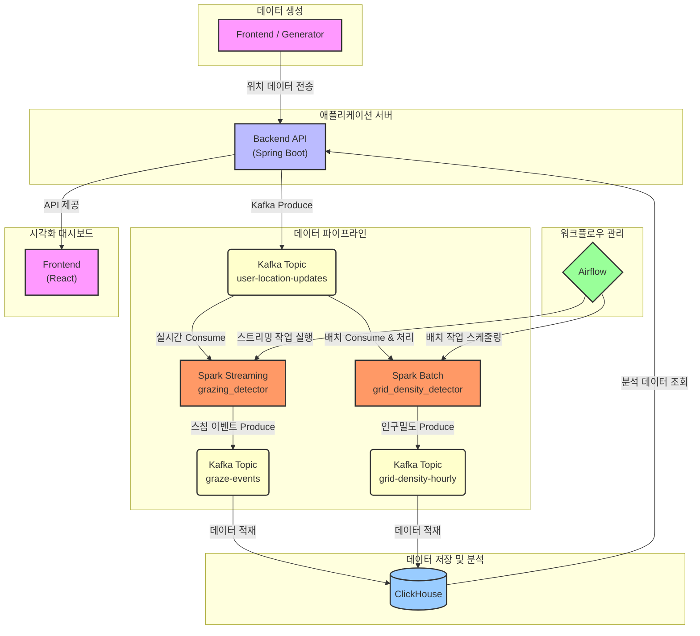

# 실시간 위치 데이터 처리 및 분석 플랫폼

## 1. 프로젝트 개요

본 프로젝트는 대규모 이동 객체의 위치 데이터를 실시간으로 생성, 수집, 처리 및 분석하기 위해 설계된 종합 데이터 플랫폼이다.

가상 더미(dummy) 데이터를 생성하는 시뮬레이터를 통해 실시간 데이터 스트림을 만들고, 이를 Kafka 메시지 큐를 통해 스트리밍/배치 처리 시스템으로 전달한다. Spark를 이용해 데이터를 분석하고, 분석 결과는 ClickHouse에 저장하여 API를 통해 시각화 대시보드로 제공한다. 전체 데이터 파이프라인은 Airflow를 통해 조율되고 관리된다.

## 2. 시스템 아키텍처

본 플랫폼은 마이크로서비스 아키텍처를 기반으로 하며, 각 컴포넌트는 Docker 컨테이너로 격리되어 `docker-compose`를 통해 관리된다.

### 데이터 흐름

1.  **데이터 생성**: `dummy-generator`(Node.js) 또는 `frontend`(React)에서 생성된 가상 사용자의 위치 데이터가 `backend`(Spring Boot) API로 전송된다.
2.  **데이터 수집**: `backend`는 수신한 데이터를 Kafka의 `user-location-updates` 토픽으로 produce한다.
3.  **데이터 처리**:
    -   **실시간 처리**: `grazing_detector` Spark 스트리밍 애플리케이션이 `user-location-updates` 토픽을 실시간으로 구독하여 '스침(Graze)' 이벤트를 감지하고, 결과를 `graze-events` 토픽으로 보낸다.
    -   **배치 처리**: Airflow가 스케줄링한 `grid_density_detector` Spark 배치 애플리케이션이 주기적으로 `user-location-updates` 토픽의 데이터를 읽어 시간대별 '인구 밀도'를 계산하고, 결과를 `grid-density-hourly` 토픽으로 보낸다.
4.  **데이터 적재**: ClickHouse는 Materialized View를 통해 Kafka 토픽을 실시간으로 구독한다. `graze-events`는 직접 적재하고, `grid-density-hourly` 데이터는 `AggregatingMergeTree` 엔진을 활용해 동일 키의 데이터를 자동으로 롤업(Rollup)하여 저장함으로써 데이터 중복을 방지하고 저장 효율을 최적화한다.
5.  **데이터 제공 및 시각화**: `backend`는 ClickHouse에 저장된 분석 데이터를 조회하는 API를 제공하며, `frontend`는 이 API를 호출하여 사용자에게 시각화된 대시보드를 보여준다.

### 컴포넌트별 역할

-   **Frontend (React)**: 사용자가 시뮬레이션을 제어하고, 스침 기록 및 인구 밀도 분석 결과를 시각적으로 확인할 수 있는 웹 대시보드.
-   **Backend (Spring Boot)**: 위치 데이터 수신 및 Kafka 전송, ClickHouse 데이터 조회 API를 담당하는 서버.
-   **Kafka & Zookeeper**: 대용량 데이터 스트림을 안정적으로 처리하기 위한 분산 메시징 시스템. 시스템의 각 컴포넌트를 분리(decoupling)하는 역할.
-   **Spark**: 실시간 및 배치 데이터 처리를 위한 분산 컴퓨팅 엔진.
-   **ClickHouse**: 대규모 데이터의 빠른 읽기 및 분석에 최적화된 Columnar DBMS. 최종 분석 결과를 저장.
-   **Airflow & PostgreSQL**: 복잡한 데이터 파이프라인(ETL)을 스케줄링하고 모니터링하는 워크플로우 관리 도구. PostgreSQL은 Airflow의 메타데이터 저장소.
-   **AKHQ**: Kafka 토픽, 메시지, 컨슈머 그룹 등을 쉽게 모니터링하고 관리할 수 있는 웹 UI 도구.
-   **Dummy-Generator (Node.js)**: CLI 환경에서 설정된 값에 따라 지속적으로 시뮬레이션 사이클을 실행하며, 지속적인 위치 데이터를 생성하는 독립 실행형 데이터 생성기.

## 3. 구현된 기능

### 3.1 데이터 생성: 동적 시뮬레이터

웹 UI 또는 CLI 환경에서 가상 이동 객체(더미)를 생성하여 실시간 위치 데이터 스트림을 만든다. 단순한 무작위 경로 생성을 넘어, '교차점 우선 생성(Intersection-First Design)' 방식을 통해 두 더미가 특정 지점에서 같은 시간(Temporal) 또는 다른 시간(Spatial)에 만나도록 경로와 속도를 지능적으로 제어할 수 있다. 이는 복잡한 동적 시나리오를 안정적으로 테스트하고 검증하는 기반이 된다.

> 자세히 보기: [데이터 생성기](./dummy-generator), [시뮬레이터 대시보드](./frontend)
> 

### 3.2 데이터 분석: 실시간 이벤트 및 배치 처리

수집된 위치 데이터는 Spark를 통해 실시간과 배치 두 가지 방식으로 처리된다.

- **스침(Graze) 이벤트 감지**: Spark Streaming을 이용해 두 이동 객체가 설정된 반경 내로 근접하는 '스침' 이벤트를 실시간으로 탐지한다.
- **인구 밀도 분석**: Airflow가 주기적으로 스케줄링하는 Spark 배치 작업을 통해, 특정 지역을 그리드(Grid)로 나누고 시간대별 인구 밀집도를 계산한다.

### 3.3 데이터 시각화: 통합 분석 대시보드

React로 구현된 웹 대시보드를 통해 시뮬레이션 제어 및 분석 결과를 직관적으로 확인할 수 있다.

- **시뮬레이터**: 지도 위에 움직이는 더미와 경로를 실시간으로 표시하고, 테이블을 통해 각 더미의 상태를 모니터링한다.
- **스침 기록**: 실시간으로 감지된 스침 이벤트의 위치를 지도 위에 애니메이션 효과가 있는 마커로 시각화한다.
- **인구 밀도**: 배치 분석 결과인 시간대별 인구 밀도를 히트맵으로 시각화하며, 슬라이더를 통해 시간 흐름에 따른 분포 변화를 탐색할 수 있다.

> 자세히 보기: [분석 대시보드](./frontend)
> 

### 3.4 [연구] 이동수단 분류 모델 개발

별도의 서브 프로젝트로, GPS 궤적 데이터 기반의 이동수단 분류 모델을 개발했다. Microsoft GeoLife 데이터셋을 사용하고, 5차에 걸친 점진적인 특징 공학 및 하이퍼파라미터 튜닝을 통해 랜덤 포레스트 모델의 성능을 개선했다. 최종적으로 `walk`, `bike`, `transport` 세 가지 클래스에 대해 **F1 점수 67.7%**를 달성했으며, 이는 향후 실제 사용자 데이터에 적용 가능한 모델의 기반이 될 수 있다.

> 자세히 보기: [이동수단 분류 모델](./ml)
>

## 4. 추가 개발 예정

### 경로 유사도 분석 및 표준 경로 도출

-   **목표**: 수집된 이동 경로 데이터를 분석하여 유사한 패턴을 가진 경로들을 그룹핑하고, 각 그룹을 대표하는 '표준 경로(Standard Route)'를 도출한다. 이는 특정 지역의 주요 이동 패턴을 파악하는 데 활용될 수 있다.
-   **구현 전략**:
    1.  **경로 재구성**: ClickHouse에 저장된 `route_id`별 위치 데이터를 시계열 순으로 묶어 완전한 경로(좌표 배열)를 복원한다.
    2.  **유사도 계산**: 두 경로의 형태와 방향성을 효과적으로 비교할 수 있는 **프레셰 거리(Fréchet Distance)** 알고리즘을 사용하여 모든 경로 쌍 간의 비유사도 점수를 계산한다.
    3.  **클러스터링**: 계산된 거리 행렬을 기반으로, 밀도 기반 클러스터링 알고리즘인 **DBSCAN**을 적용하여 유사 경로 그룹을 자동으로 찾아낸다. DBSCAN은 그룹의 개수를 미리 지정할 필요가 없고 노이즈를 효과적으로 식별하는 장점이 있다.
    4.  **대표 경로 선정**: 각 클러스터 내에서 다른 모든 경로와의 평균 거리가 가장 짧은 **메도이드(Medoid)** 경로를 해당 그룹의 '표준 경로'로 선정한다.
    5.  **결과 저장 및 시각화**: 도출된 표준 경로와 해당 경로에 포함된 경로의 수(카운트)를 ClickHouse에 저장하고, 프론트엔드에서 이를 시각화하여 보여준다.
 
### 이동수단 분류 모델의 고도화 및 적용

- **목표**: 연구 단계에 있는 이동수단 분류 모델을 실제 플랫폼에 통합하고, 수집되는 라이브 데이터를 활용해 예측 정확도를 지속적으로 향상시킨다. 이를 통해 사용자에게 이동수단에 따른 맞춤형 분석 정보를 제공하는 것을 최종 목표로 한다.
- **구현 전략**:
    1. **초기 모델 적용**: `/ml` 프로젝트에서 개발된 사전 훈련 모델(F1 점수 67.7%)을 `user-location-updates` 데이터 스트림에 적용하여, 각 이동 객체의 이동수단(`walk`, `bike`, `transport`)을 실시간으로 추론한다.
    2. **피드백 기반 데이터 수집**: '도메인 이동(Domain Shift)' 문제에 대응하기 위해, 사용자가 자신의 이동 기록에서 잘못 분류된 이동수단을 직접 수정할 수 있는 기능을 제공한다. 이렇게 수집된 `(실제 위치 데이터, 사용자가 수정한 정답 라벨)`은 고품질의 학습 데이터셋이 된다.
    3. **실 데이터 기반 피처 엔지니어링**: 축적된 실제 사용자 데이터를 분석하여, 기존 GeoLife 데이터셋에서는 발견하지 못했던 새로운 특징(Feature)을 발굴하고 모델에 추가한다.
    4. **주기적인 재학습 및 배포**: Airflow를 통해 월 또는 분기 단위로 재학습 파이프라인을 자동화한다. 이 파이프라인은 기존 데이터와 새로 수집된 사용자 피드백 데이터를 함께 사용하여 모델을 미세 조정(Fine-tuning)하고, 성능이 검증된 새로운 모델을 자동으로 배포하여 점진적으로 예측 정확도를 향상시킨다.
