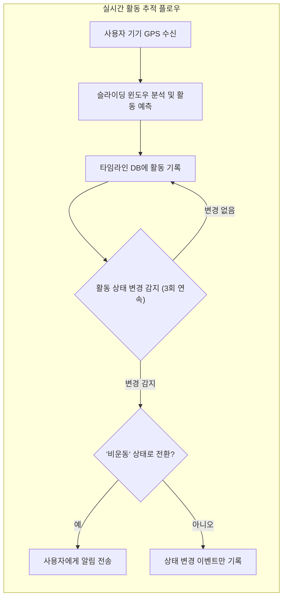
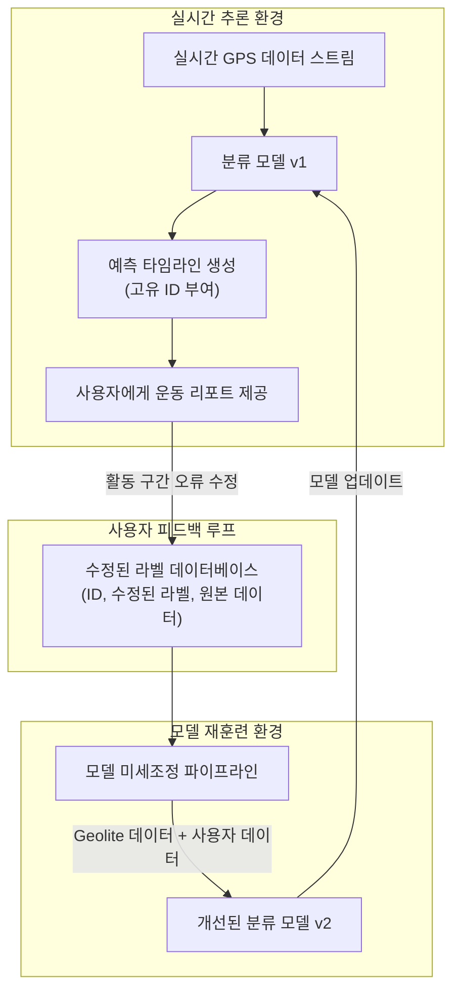

# 실시간 GPS 데이터를 활용한 이동수단 분류 모델

## 1. 프로젝트 목표

본 프로젝트는 사용자의 GPS 궤적 데이터를 실시간으로 분석하여 현재 이동수단을 분류하는 머신러닝 모델을 구축하는 것을 목표로 한다. 이를 통해 다음과 같은 핵심 기능을 구현한다.

### 1.1. 핵심 기능

1.  **실시간 활동 전환 탐지:**
    * 사용자의 운동 세션 중, 활동이 '걷기', '달리기'와 같은 운동 상태에서 '차량 탑승'과 같은 비운동 상태로 전환되는 것을 실시간으로 감지한다.
    * 비운동 상태가 일정 시간(예: 1분 이상) 지속될 경우, 사용자에게 운동 앱 종료를 유도하는 알림을 전송하여 정확한 운동 기록을 돕는다.

2.  **운동 후 활동 분석:**
    * 운동 세션이 종료된 후, 전체 GPS 데이터를 분석하여 해당 세션의 주요 활동(예: 달리기)을 정의한다.
    * 전체 운동 시간 중 '걷기', '달리기', '자전거' 등 각 활동이 차지하는 비율과 구간을 계산하여 상세한 요약 리포트를 제공한다.

### 1.2. 실시간 처리 플로우

모델은 다음과 같은 절차에 따라 사용자의 활동을 실시간으로 추적하고 상태 변화를 감지한다.

1. [수집] 사용자 기기로부터 실시간 GPS 데이터(위도, 경도, 타임스탬프)를 수신한다.
2. [분석] 수신된 데이터를 60초 단위의 슬라이딩 윈도우로 분석하여 현재 활동을 예측한다. (예: '걷기')
3. [기록] 예측된 활동 상태를 타임스탬프와 함께 타임라인 데이터베이스에 기록한다.
4. [전환 감지] 이전 상태와 다른 새로운 활동(예: '차량') 예측이 3회 연속(또는 1분 이상) 누적되는지 확인한다.
5. [이벤트 발생] 조건 충족 시, '활동 상태 변경' 이벤트를 시스템에 발생시킨다.
6. [알림 전송] 이벤트가 '비운동'(예: 차량, 버스) 상태로의 전환을 의미할 경우, 사용자에게 관련 알림을 보낸다.

## 2. 데이터 처리 및 모델 학습 파이프라인

모델 구축은 데이터 수집, 전처리, 특징 공학, 모델 훈련 및 평가의 표준 워크플로우를 따른다.

* **데이터 소스:** Microsoft GeoLife GPS Trajectory Dataset을 초기 훈련 데이터로 사용한다.
* **데이터 분할:** 원시 GPS 궤적을 훈련 및 추론 환경의 일관성을 위해 **60초 윈도우 크기**와 **30초 이동 간격(50% 겹침)** 을 갖는 슬라이딩 윈도우 기법으로 분할한다.
* **핵심 알고리즘:** 다수의 결정 트리를 결합하여 과적합 위험이 적고 안정적인 성능을 보이는 **랜덤 포레스트(Random Forest)** 분류기를 사용한다.
* **훈련/테스트 분할:** 전체 데이터셋을 8:2 비율로 분할하여 80%는 모델 훈련에, 20%는 성능 검증에 사용한다.

### 2.1. 추출 특징(Features)

각 60초 윈도우(세그먼트)로부터 다음과 같은 통계적/물리적 특징을 추출하여 모델 학습에 사용한다.

| 특징 범주    | 특징 이름            | 설명 및 근거                                                             |
| :----------- | :------------------- | :----------------------------------------------------------------------- |
| **운동학적** | `avg_speed`, `max_speed`   | 평균/최대 속도. 이동수단 구분의 가장 핵심적인 특징.                      |
|              | `p75_speed`, `p95_speed`   | 속도 분포의 75, 95번째 백분위수. 순간적인 고속 주행 패턴 포착.         |
|              | `stddev_speed`       | 속도의 표준편차. 속도 변화의 정도를 나타내어 정체 구간 등을 감지.        |
|              | `avg_accel`, `max_accel`   | 평균/최대 가속도. 출발 및 정지 패턴의 강도 측정.                         |
|              | `stddev_accel`       | 가속도의 표준편차. 버스와 같이 정차/출발이 잦은 경우 값이 높게 나타남.   |
|              | `stop_rate`          | 정차 비율. 속도가 특정 임계값 이하인 시간의 비율로 정체 빈도 측정.       |
| **방향성** | `avg_bearing_rate`   | 평균 방위각 변화율. 경로의 회전 정도로 직선 주행(기차)과 도심 주행 구분. |
|              | `HCR_rate`           | 급회전 비율. 방위각 변화율이 임계값을 초과하는 비율로 급격한 방향 전환 빈도 측정. |
| **기하학적** | `total_distance`     | 세그먼트의 총 이동 거리.                                                 |
|              | `straightness_index` | 경로 직선성. (직선 거리) / (총 이동 거리)로 계산. 1에 가까울수록 직선 경로. |

---

## 3. 향후 개선 방향: 점진적 학습을 통한 모델 진화 (미정)

### 3.1. 문제 인식: 도메인 이동(Domain Shift)

GeoLife 데이터셋은 주로 중국 베이징에서 수집되었으므로, 이를 기반으로 한 모델을 한국과 같이 교통 흐름, 도로 상황, 대중교통 패턴이 다른 환경에 직접 적용할 경우 성능 저하가 발생할 수 있다.

### 3.2. 해결 방안: 사용자 피드백 기반의 점진적 학습

이 문제를 해결하고 지속적으로 모델 성능을 향상시키기 위해, 사용자 피드백을 활용하는 점진적 학습(Incremental Learning) 파이프라인을 도입한다.

1.  **피드백 수집:** 운동 후 제공되는 분석 리포트에서 사용자가 잘못 분류된 활동 구간을 직접 수정(재라벨링)할 수 있는 기능을 제공한다. (예: "이 구간은 자전거가 아니라 달리기였어요.")
2.  **데이터 축적:** 이렇게 수집된 `(수정된 라벨, 원본 GPS 데이터)` 쌍을 별도의 데이터베이스에 안전하게 저장하고 축적한다.
3.  **모델 미세조정(Fine-tuning):** 축적된 새로운 데이터를 사용하여 기존에 훈련된 모델을 주기적으로 재훈련하거나 미세 조정한다. 이 과정을 통해 모델은 점차 한국의 실제 도로 환경과 사용자 개개인의 활동 패턴에 적응하며 진화한다.

### 3.3. 점진적 학습 아키텍처

아래는 사용자 피드백을 통해 모델이 스스로 성능을 개선해나가는 전체 아키텍처를 나타낸다.

이러한 접근 방식을 통해, 초기 모델의 한계를 극복하고 시간이 지남에 따라 더욱 정확하고 개인화된 서비스를 제공할 수 있다.